# Homey Self-Hosted Server - Proxmox Interactive Installer

An interactive version of the Homey SHS installer for Proxmox VE, featuring a user-friendly wizard interface and additional configuration options.

## Why use the Interactive Installer?

The standard Homey SHS installer uses fixed defaults (`local`, `local-lvm`, `vmbr0`). This interactive version offers:

- **Storage selection** - Automatically detects available storages instead of assuming `local` and `local-lvm`
- **Network bridge selection** - Detects all available bridges instead of assuming `vmbr0`
- **VLAN support** - Configure VLAN tags on VLAN-aware bridges
- **Auto-update control** - Choose whether to automatically pull the latest Docker image on restart
- **Migration support** - Option to skip starting Homey SHS, allowing you to restore userdata first

## Requirements

- Proxmox VE 7.x or 8.x
- Root access to the Proxmox host
- Internet connection

The following tools are required (included by default on Proxmox):
- `whiptail` - For interactive dialogs
- `jq` - For JSON parsing

If not present:
```bash
apt update && apt install -y whiptail jq
```

## Installation

### Direct execution (recommended)

```bash
bash -c "$(curl -fsSL https://raw.githubusercontent.com/your-repo/homey-shs-toolkit/main/Proxmox_Interactive_Installer/homey-shs-proxmox-interactive.sh)"
```

### Manual download

```bash
curl -O https://raw.githubusercontent.com/your-repo/homey-shs-toolkit/main/Proxmox_Interactive_Installer/homey-shs-proxmox-interactive.sh
chmod +x homey-shs-proxmox-interactive.sh
./homey-shs-proxmox-interactive.sh
```

## Installation Steps

The wizard guides you through each configuration option:

### Step 1: Container ID

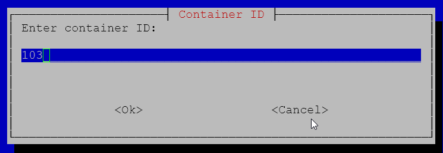

### Step 2: Hostname

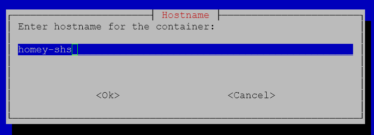

### Step 3: Template Storage

Automatically shows all storages that support container templates.

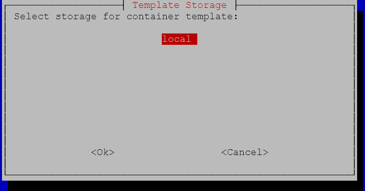

### Step 4: Root Filesystem Storage

Automatically shows all storages that support container root filesystems.

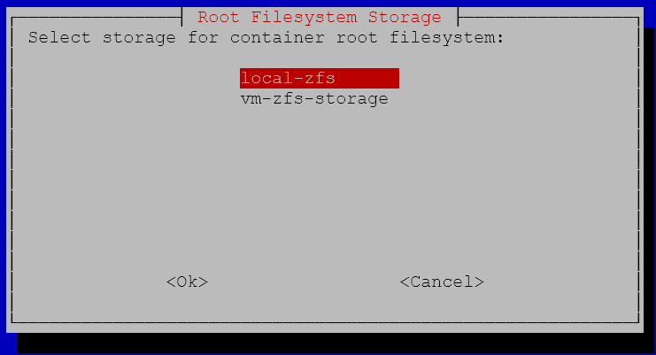

### Step 5: Network Bridge

Automatically detects all available network bridges.

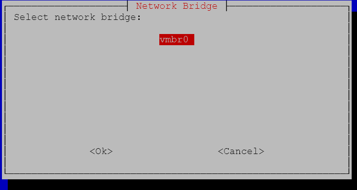

### Step 6: VLAN Tag (optional)

Only shown if the selected bridge is VLAN-aware.

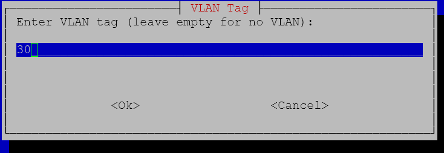

### Step 7: Resources

| Resource | Default | Minimum recommended |
|----------|---------|---------------------|
| Disk     | 16 GB   | 8 GB                |
| CPU      | 2 cores | 1 core              |
| RAM      | 2048 MB | 1024 MB             |
| Swap     | 512 MB  | 256 MB              |

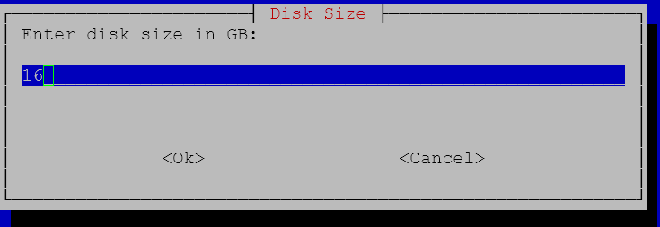
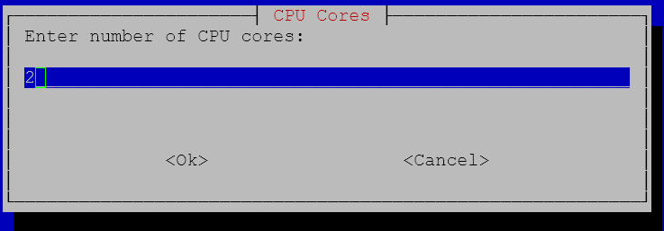
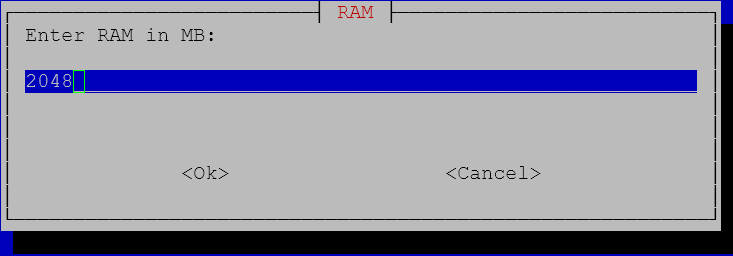
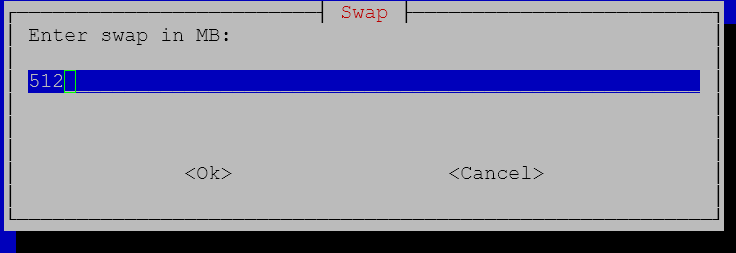

### Step 8: Root Password

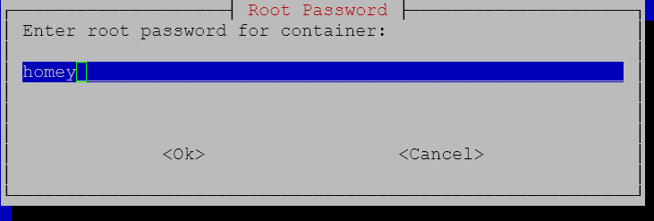

### Step 9: Autostart Homey SHS after installation

Choose whether to start Homey SHS immediately after installation:
- **Yes** - Normal installation, starts immediately
- **No** - For migrations: restore userdata before first start

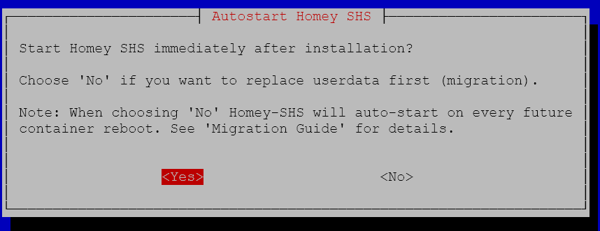

### Step 10: Auto Update Homey on restart service / LXC

Choose whether to automatically pull the latest Docker image:
- **Yes** - Pull latest image on every service restart (Default)
- **No** - Only pull if no image exists locally

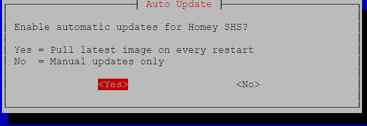

### Step 11: Confirmation

Review all settings before installation begins.

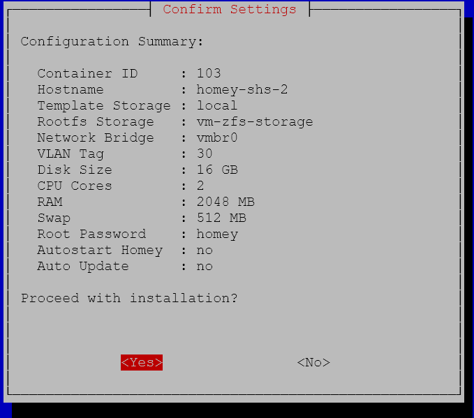

## After Installation

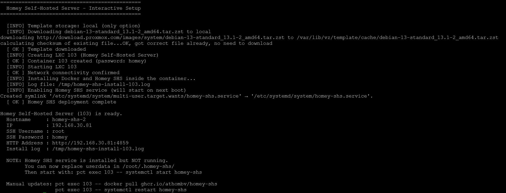

### Access

| Type | Address |
|------|---------|
| Web interface | `http://<IP>:4859` |
| SSH | `ssh root@<IP>` |

### Important paths

| Path | Description |
|------|-------------|
| `/root/.homey-shs/` | Homey userdata |
| `/usr/local/bin/homey-shs.sh` | Deploy script |
| `/tmp/homey-shs-install-<CTID>.log` | Installation log |

## Management

```bash
# View status
pct exec <CTID> -- systemctl status homey-shs

# Restart
pct exec <CTID> -- systemctl restart homey-shs

# View logs
pct exec <CTID> -- docker logs homey-shs
```

### Manual update (when auto-update disabled)

```bash
pct exec <CTID> -- docker pull ghcr.io/athombv/homey-shs
pct exec <CTID> -- systemctl restart homey-shs
```

## Migration Guide

To migrate an existing Homey SHS installation:

1. Run the installer and select **No** at "Autostart Homey SHS"
2. Copy your userdata to the new container (/root/.homey-shs).
3. Start Homey SHS:
   ```bash
   pct exec <CTID> -- systemctl start homey-shs
   ```

## Troubleshooting

### Container won't start
```bash
pct status <CTID>
pct start <CTID> --debug
```

### No network
```bash
pct exec <CTID> -- ip addr
pct exec <CTID> -- dhclient eth0
```

### Homey SHS won't start
```bash
pct exec <CTID> -- systemctl status homey-shs
pct exec <CTID> -- docker ps -a
cat /tmp/homey-shs-install-<CTID>.log
```

## License

MIT License